# Discover the pipeline decorators in Azure DevOps

Pipeline decorators are almost unknown in Azure DevOps, but immensely powerful. I have helped companies to implement a DevOps culture in their development process for more than ten years. What I observed is the concern with the implementation of governance. The stakeholders want to achieve large freedom for developers' teams, while they need to ensure reasonable quality and security level for the development phase.
Pipelines are a solution. They allow you to inject steps to the beginning and the end of every job in any workflow of your organization, and this is automatically done without the consent/control of the owners of the workflow. That is what this article will try to demystify.

This subject will be split into five parts:

- Part 1: What are pipeline decorators and create your first decorator
- Part 2: Deploy your decorator, validate it, and enhance it
- Part 3: Create a more advanced decorator: a docker linter
- Part 4: Create another advanced decorator: a credentials scanner
- Part 5: Tips and tricks

> Find the latest version of [the guide and the source code of all decorators here](https://github.com/lgmorand/azure-devops-pipeline-decorators).

## Part 1: Our first decorator

### What are pipeline decorators?

Pipeline decorators are [custom tasks](https://learn.microsoft.com/en-us/azure/devops/extend/develop/add-build-task) (build or release) that can be injected automatically into all workflows of an Azure DevOps organization without the consent of the creators of the different pipelines. In a perfect world, within an organization, each development team is responsible to build their pipelines and ensure they follow the company's common good practices. In some cases, to help them, a team (often the one owning the Azure DevOps organization) creates custom tasks and makes them available to users to enrich their pipelines. It could be a wrapper to build something complex or to call a tool such as a SCA/SAST (security code analyzer).

The issue with this approach is that you can't ensure that users will add the required tasks to their pipelines, and they could easily bypass the quality processes you are trying to set up during the development lifecycle. That's where the pipeline decorators are the solution.

### Requirements

To follow this guide and be able to create pipeline decorators and deploy them, you will require several things:

- An Azure DevOps organization where you are an administrator (you can [create one for free](https://learn.microsoft.com/en-us/azure/devops/organizations/accounts/create-organization))
- A publisher account on the Azure DevOps marketplace
- [TFX CLI](https://www.npmjs.com/package/tfx-cli), which requires [NodeJS](https://nodejs.org) to be installed on your machine
- (Optional) [Visual Code Extension Manager](https://github.com/microsoft/vscode-vsce) (VSCE)

### Create our first decorator

We are going to start with a quite elementary example. In this "hello world" example, we are going to see how to inject a simple task in all workflows of our organization to see the concept of build and deploying a pipeline decorator. Later, we will see how to leverage the customization of these decorators and then create more complex decorators.

Create a folder and name it banner-decorator and create two files: *vss-extension.json* and *banner-decorator.yml*. The structure should look like this:

```bash
| banner-decorator
| -- vss-extension.json
| -- banner-decorator.yml
```

We need to declare the actions which will be performed by our decorator, for instance, we could name it *banner-decorator.yml*. The format is the same as for YAML pipelines, where you can add different steps. In our first decorator, we will add only one step to display a message in the pipeline's logs.

```yaml
steps:
  - task: CmdLine@2
    displayName: '(Injected) Here is my super banner'
    inputs:
      script: |
        echo "This step is automatically injected in your workflow as part of the governance of the company"
        
        echo "_______  _        _        _______ "
        echo "|\     /|(  ____ \( \      ( \      (  ___  )"
        echo "| )   ( || (    \/| (      | (      | (   ) |"
        echo "| (___) || (__    | |      | |      | |   | |"
        echo "|  ___  ||  __)   | |      | |      | |   | |"
        echo "| (   ) || (      | |      | |      | |   | |"
        echo "| )   ( || (____/\| (____/\| (____/\| (___) |"
        echo "|/     \|(_______/(_______/(_______/(_______)"
        echo " "
        echo " _______                    _______  _ "
        echo "(  ____ \|\     /||\     /|(  ____ \( )"
        echo "| (    \/| )   ( |( \   / )| (    \/| |"
        echo "| |      | |   | | \ (_) / | (_____ | |"
        echo "| | ____ | |   | |  \   /  (_____  )| |"
        echo "| | \_  )| |   | |   ) (         ) |(_)"
        echo "| (___) || (___) |   | |   /\____) | _ "
        echo "(_______)(_______)   \_/   \_______)(_)"
```

We now need to create the manifest to describe our extension, to specify its type (decorator) and the conditions to inject it. Several fields are mandatory:

- **id**: An ID to name your decorator
- **type**: Specifies that this contribution is a pipeline decorator. Must be the string **ms.azure-pipelines.pipeline-decorator**
- **targets**: Decorators can run before your job/specified task, after, or both. See the table below for available options
- **properties.template**: The YAML template that defines the steps for your pipeline decorator. It is a relative path from the root of your extension folder
- **properties.targettask** (Optional): The target task ID used for ms.azure-pipelines-agent-job.pre-task-tasks or ms.azure-pipelines-agent-job.post-task-tasks targets. Must be GUID string like 89b8ac58-8cb7-4479-a362-1baaacc6c7ad

The question we have to ask ourselves is "where do we want to inject our decorator"? At the beginning, at the end of the pipeline? In a release pipeline or only during build pipeline?

| Target | Description |
|---|---|
|ms.azure-pipelines-agent-job.pre-job-tasks|Run before other tasks in a classic build or YAML pipeline. Due to differences in how source code checkout happens, this target runs after checkout in a YAML pipeline but before checkout in a classic build pipeline.|
|ms.azure-pipelines-agent-job.post-checkout-tasks|Run after the last checkout task in a classic build or YAML pipeline.|
|ms.azure-pipelines-agent-job.post-job-tasks|Run after other tasks in a classic build or YAML pipeline.|
|ms.azure-pipelines-agent-job.pre-task-tasks|Run before the specified task in a classic build or YAML pipeline.|
|ms.azure-pipelines-agent-job.post-task-tasks|Run after the specified task in a classic build or YAML pipeline.|
|ms.azure-release-pipelines-agent-job.pre-task-tasks|Run before the specified task in a classic RM pipeline.|
|ms.azure-release-pipelines-agent-job.post-task-tasks|Run after the specified task in a classic RM pipeline.|
|ms.azure-release-pipelines-agent-job.pre-job-tasks|Run before other tasks in a classic RM pipeline.|

In our case, we want to display the banner at the beginning of any workflow and we need to reference our YAML file (banner-decorator.yml):

```json
"contributions": [
        {
            "id": "my-required-task",
            "type": "ms.azure-pipelines.pipeline-decorator",
            "targets": [
                "ms.azure-pipelines-agent-job.pre-job-tasks"
            ],
            "properties": {
                "template": "banner-decorator.yml"
            }
        }
    ],
```

The last part is related to the files that should be included during the packaging process:

```json
"files": [
        {
            "path": "banner-decorator.yml",
            "addressable": true,
            "contentType": "text/plain"
        }
    ]
```

The definitive version of your *vss-extension.json* file should look like this:

```json
{
    "manifestVersion": 1,
    "id": "bannerdecorator-by-lgmorand",
    "name": "A simple banner decorator",
    "version": "1.0.0",
    "publisher": "lgmorand",
    "targets": [
        {
            "id": "Microsoft.VisualStudio.Services"
        }
    ],    
    "description": "A simple banner decorator which will display a message.",
    "categories": [
        "Azure Pipelines"
    ],
    "contributions": [
        {
            "id": "my-injected-banner",
            "type": "ms.azure-pipelines.pipeline-decorator",
            "targets": [
                "ms.azure-pipelines-agent-job.pre-job-tasks"
            ],
            "properties": {
                "template": "banner-decorator.yml"
            }
        }
    ],
    "files": [
        {
            "path": "banner-decorator.yml",
            "addressable": true,
            "contentType": "text/plain"
        }
    ]
}
```

We now need to package it as an Azure DevOps extension because that is how it is published. There are several types of extensions such as build tasks, Web extensions to enrich the UI and pipeline decorators as well. To create our extension, we need to use [TFX CLI](https://www.npmjs.com/package/tfx-cli). Start by installing it on your system:

```bash
npm install -g tfx-cli
```

Then, open a prompt and ensure that you are currently located in the root folder of your pipeline decorator. From there, you can use the command *extension create*

```bash
tfx extension create
```

You should obtain a new file with the VSIX extension, based on the information you put in *vss-extension.json*.

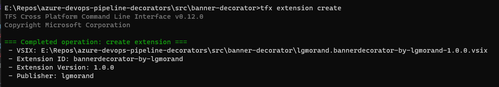

Our pipeline decorator is ready, it's now time to publish it to our organization. This will be covered in the second part of this article.

## Part 2: Deploy your decorator, validate it, and enhance it

### Create a publisher account

Since Azure DevOps Services is a SaaS offering, the only way to customize your organization is to install extensions but these extensions must come from the [Azure DevOps Marketplace](https://marketplace.visualstudio.com/azuredevops). In our case, we need to publish our pipeline decorator on this marketplace (which is an extension) but to do so, we need to release it under a publisher name even if, as we'll see later, nobody except our organization will be able to see/install our extension.

> Publisher account is only required if you plan to install your extension to Azure DevOps Services (SaaS version). On Azure DevOps Server (on-premises), the standalone VSIX file is sufficient.

For that, go to the [management portal](https://marketplace.visualstudio.com/manage) which should ask you to create your publisher account. Be aware that the  user with whom you create the publisher account is important, as this account would also need to be an administrator of your Azure DevOps organization

> During the creation of my publisher, I discovered that my ID was used already. The existing publisher was created using another account when I was younger. I tried to delete the existing publisher without success until I discovered a proper solution which I [documented here](https://lgmorand.github.io/blog/delete-publisher).

### Upload your extension

It's now time to upload our extension on the marketplace. For that, you need:

- the generated extension (*.vsix)
- ensuring the ID contained in its manifest (vss-extension.json) matches exactly the name of the publisher account you just created


Once the extension is uploaded and validated, you can check the result by opening the contextual menu (...) and choosing "*View extension*" to see the final page of your extension. That is what a user would see if your extension was public:

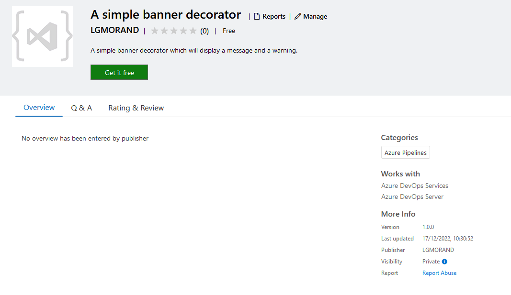

We still need to make it available from our org. To do so, from the context menu, click on "*Share/Unshare*" to open a side panel where you can type the name of organizations you want your extension to be available:

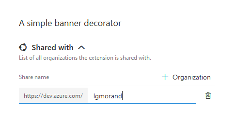

Now, go back to your Azure DevOps organization. Once there, open the *Organization settings* screen and then the *extensions* tab. This screen shows the **Installed** extensions, the **Requested** extensions which are the extensions users without enough right tried to add to the organization and the **Shared** extensions. That is in this last screen that you should now see your custom decorator.

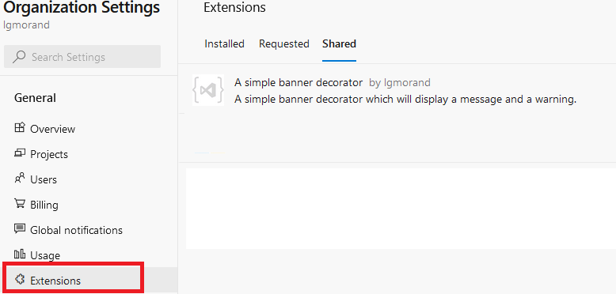

This only means that the extension is available but does not mean it is installed yet. You must now click on the extension and select "*Install*" to effectively install it on your organization.

### Time to check that the decorator is working

This part is the easiest one. We added no specific conditions to our manifest except that it should run for any pipeline (classic or YAML) by using the property *ms.azure-pipelines-agent-job.pre-job-tasks*.

Run any of your pipelines and check for the result.

### Enhance our decorator

A decorator is injected implicitly in any pipeline run, and it could surprise the users to see that something has been added to their pipeline but they can't explain where it comes from. We are going to improve it using diverse ways:

- add an icon to brand your decorator
- add a readme-like experience that provides information regarding your decorator
- a hint in its title
- a log message

First, we need to help our users that the injected steps are not here accidentally or by their hand. I like to add "(injected)" in the title of the steps as a hint.

```yaml
steps:
  - task: CmdLine@2
    displayName: '(Injected) Here is my super banner'
```

And you could also add a simple log message with your decorator YAML file.

```bash
echo "This step is automatically injected in your workflow as part of the governance of the company"
```

A second quick win is to add an icon to your extension which will make it more recognizable. In the folder of your decorator, add a folder named "images" et put an image in PNG format (size should 128 x 128 pixels). Then reference this icon in the *vss-extension.json* by adding:

```json
"icons": {
        "default": "images/extension-icon.png"        
},
```

Add an overview

If you try to repackage your decorator and try to upload it to the portal, you will get an error message:


It means that you must increment the version inside the manifest (vss-extension.json).

Take few seconds to increase the number of the property *version*. Your final file should be something like this (the YAML file banner-decorator.yml remains unchanged):

```json
{
    "manifestVersion": 1,
    "id": "bannerdecorator-by-lgmorand",
    "name": "A simple banner decorator",
    "version": "1.0.1",
    "publisher": "lgmorand",
    "targets": [
        {
            "id": "Microsoft.VisualStudio.Services"
        }
    ],    
    "description": "A simple banner decorator which will display a message and a warning.",
    "categories": [
        "Azure Pipelines"
    ],
    "icons": {
        "default": "images/extension-icon.png"        
    },
    "contributions": [
        {
            "id": "my-injected-banner",
            "type": "ms.azure-pipelines.pipeline-decorator",
            "targets": [
                "ms.azure-pipelines-agent-job.pre-job-tasks"
            ],
            "properties": {
                "template": "banner-decorator.yml"
            }
        }
    ],
    "files": [
        {
            "path": "banner-decorator.yml",
            "addressable": true,
            "contentType": "text/plain"
        }
    ]
}
```

You can also use the --rev-version parameter which will increment it for you during packaging:

```bash
tfx extenstion create --rev-version
```

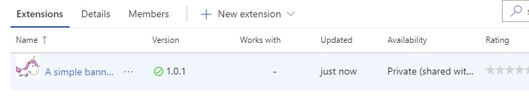

If you go back to your organization, you will note that the extension has been automatically updated to the last version; you don't need to reinstall it.

We can now enrich our decorator to output a second message at the end of the workflow without creating a second decorator. For that, you just need to add another *contribution* with a *post-job* target and optionally use a different YAML file. The conditions would look like this:

```json
"contributions": [
        {
            "id": "my-injected-banner",
            "type": "ms.azure-pipelines.pipeline-decorator",
            "targets": [
                "ms.azure-pipelines-agent-job.pre-job-tasks"
            ],
            "properties": {
                "template": "banner-decorator.yml"
            }
        },
        {
            "id": "my-second-injected-banner",
            "type": "ms.azure-pipelines.pipeline-decorator",
            "targets": [
                "ms.azure-pipelines-agent-job.post-job-tasks"
            ],
            "properties": {
                "template": "byebye.yml"
            }
        }
    ]
```

And the result, once injected into a workflow, should look like this:

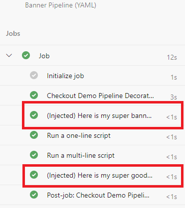

> *Source code:* the source of [this decorator can be downloaded here](https://github.com/lgmorand/azure-devops-pipeline-decorators/tree/main/src/banner-decorator).

## Part 3: Create a docker linter

For this second decorator, we would like to build a task responsible for analyzing a Dockerfile and checking that it follows good practices. There are plenty of tools to do like [dockle](https://github.com/goodwithtech/dockle), [hadolint](https://github.com/hadolint/hadolint) and in our case [dockerfilelint](https://github.com/replicatedhq/dockerfilelint) chosen for its simplicity.

### Build our linter task

Technically, we need to create a task that:

- checks if a Dockerfile exists in the source code
- if any file is found, install dockerfileint
- scan any Dockerfile and report the results
- stops the workflow if issues have been found

Our script within our decorator could look like this:

```yml
steps:
  - task: CmdLine@2
    displayName: '(Injected) Docker linter'
    inputs:
      script: |
        
        echo 'looking for DockerFile'
        filePath=$(find -type f -name Dockerfile)
        if [ -z "$filePath" ]
        then
              echo "No Dockerfile was found"
        else
              echo "Dockerfile(s) found: $filePath"

              echo 'installing dockerfilelint'
              npm install -g dockerfilelint --silent
              echo 'Installed version: '
              dockerfilelint -v
              
              echo 'running dockerfilelint'
              find -type f -name 'Dockerfile' -exec dockerfilelint {} \;
              # explanation of find+exec: https://stackoverflow.com/questions/9612090/how-to-loop-through-file-names-returned-by-find

              if echo "$result" | grep -q "None found"; then
                  echo "no issues found"
              else
                  echo "issues found"
                  exit 1 # throw an error to stop the workflow
              fi
        fi
```

Once the YAML file, is ready, we just need to create the vss-extension file:

```json
{
    "manifestVersion": 1,
    "id": "dockerlinter-by-lgmorand",
    "name": "A docker linter decorator",
    "version": "1.0.0",
    "publisher": "lgmorand",
    "targets": [
        {
            "id": "Microsoft.VisualStudio.Services"
        }
    ],    
    "description": "A docker linter based on dockerfilelint.",
    "categories": [
        "Azure Pipelines"
    ],
    "icons": {
        "default": "images/extension-icon.png"        
    },
    "content": {
        "details": {
            "path": "overview.md"
        }
    },
    "contributions": [
        {
            "id": "docker-linter-decorator",
            "type": "ms.azure-pipelines.pipeline-decorator",
            "targets": [
                "ms.azure-pipelines-agent-job.pre-job-tasks"
            ],
            "properties": {
                "template": "docker-linter-decorator.yml",
            }
        }
    ],
    "files": [
        {
            "path": "docker-linter-decorator.yml",
            "addressable": true,
            "contentType": "text/plain"
        }
    ]
}
```

We can now package it, publish it and deploy it to our organization.

### My decorator is injected too often

If we evaluate it, our decorator is working perfectly but it is also injected in all workflows of our organization, including those who don't use Docker technology. This could be an issue as it will increase the time of each pipeline execution (especially if the source code contains numerous files) and if you have several decorators in your organization, each pipeline could get polluted by irrelevant decorators.

We need to find a way to target only pipelines which are using Dockerfile. We could restrict the decorator to run for specific projects by adding a condition, but it would require to hard-code the GUID of each project like this (there are [other ways to filter by project](#part-5-tips-and-tricks)):

```yaml
steps:
- ${{ if eq(resources.repositories['self'].project, '123455-2492-6524-9851-564526e8fc8') }}
```

Another way of doing it is to target the presence of specific tasks in the pipelines. In our case, we want to analyze any Dockerfile with the tool *dockerfilelint* before we use the file to build a Docker image. We just need to find pipelines where we use the Docker file. The simplest way to do it is to target pipelines that contains the built-in Docker task:

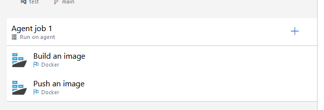

In our case, the ID of the Docker task is: "e28912f1-0114-4464-802a-a3a35437fd16"

> To find the ID of a task, you can either check [this repository](https://github.com/microsoft/azure-pipelines-tasks/tree/master/Tasks) if the task is a built-in task, and open the task.json file. If the task is a custom task from the marketplace, you just need to download its VSIX file and unzip it to find the task.json file. To obtain the VSIX from a custom task, just go on the marketplace and try to install it. Instead of installing it on your organization, choose the Azure DevOps Server option and download the file:
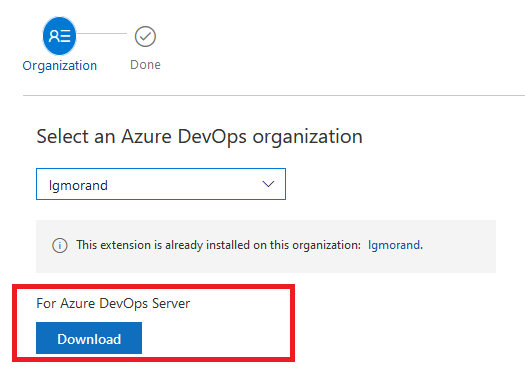

Once we have the task's ID, we need to alter the target of our decorator to say, "inject it before each occurrence of a specific task" and we can do it using the target **ms.azure-pipelines-agent-job.pre-task-tasks** and by adding the property *targettask* with the GUID of our task.

Our final vss-extension file looks like this:

```json
"contributions": [
    {
        "id": "docker-linter-decorator",
        "type": "ms.azure-pipelines.pipeline-decorator",
        "targets": [
            "ms.azure-pipelines-agent-job.pre-task-tasks"
        ],
        "properties": {
            "template": "docker-linter-decorator.yml",
            "targettask": "e28912f1-0114-4464-802a-a3a35437fd16"
        }
    }
],
```

> Note: if the users use directly the *docker* command within a script or a simple CmdLine task, our decorator would not work as we can't parse the pipeline file to detect a keyword. There is no solution that I'm aware of for such use case.

Let's package a new version of our decorator and deploy it. If we run any workflow which uses the Docker task, then our decorator is injected as seen in [this example](https://dev.azure.com/lgmorand/Demo%20Pipeline%20Decorators/_build/results?buildId=3181&view=logs&j=275f1d19-1bd8-5591-b06b-07d489ea915a) :

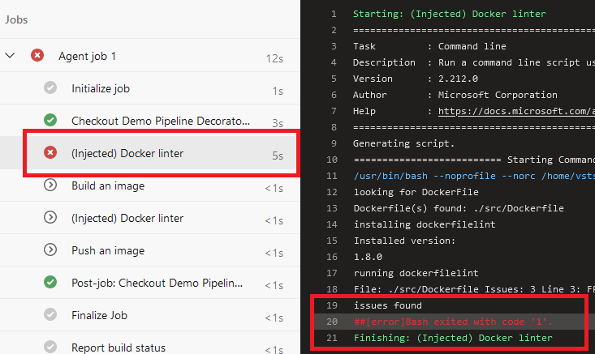

It's not perfect but it does the job and injecting a decorator before specific tasks is very useful to target specific workflows.

## Part 4: Create a smart credential scanner

For this last decorator, we are going to inject another security tool in the pipeline, but only if the tool is not already present in the workflow. Furthermore, we will need to do more than inject command lines.

> Important: This extension is private and not listed on the public Azure DevOps marketplace. Don't look for it. Nevertheless, I choose it because it matches perfectly what I'm willing to show.

### Specify what we want to scan and how

This extension contains a dozen of security tools, and each pipeline may require different tasks depending on what you want to scan or perform. In my case, I need:

- a task to scan the files to search for credentials
- a task to transform the results into a standard SARIF file
- a task to upload the SARIF file as an artifact
- a task to stop the workflow if credentials are found

In a classic workflow, it looks like this:

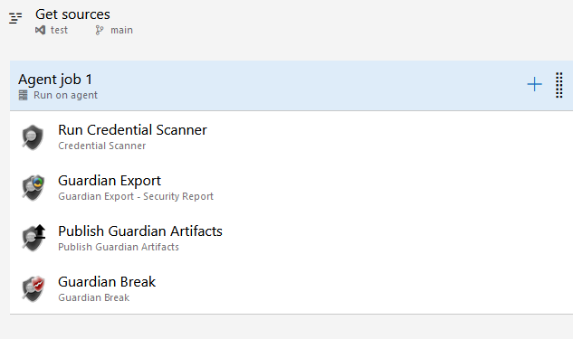

We want to create a decorator that injects the same four tasks, but we need to get their internal names first. To get the name of a task, you can either create a dummy YAML pipeline or you can create a dummy classic pipeline. Once configured, click on "View yaml" button, and you obtain the generated YAML which contains exactly what you want to put in your decorator.

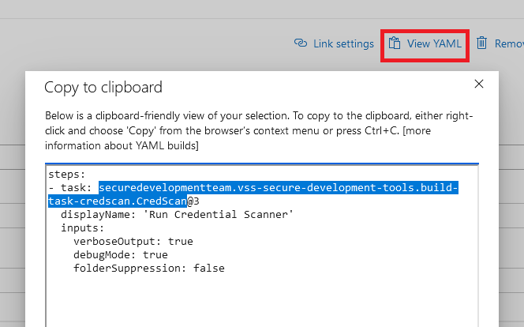

Once we got the task's name for every one of them, we can build my decorator YAML file, which will inject these four tasks whenever the task "Run Credential scanner" is **not** found:

```yaml
steps:
- ${{ if not(containsValue(job.steps.*.task.id, 'ea576cd4-c61f-48f8-97e7-a3cb07b90a6f')) }}:
  - task: securedevelopmentteam.vss-secure-development-tools.build-task-credscan.CredScan@3
    displayName: 'Run CredScan (Injected)'
    inputs:
      debugMode: false
  - task: securedevelopmentteam.vss-secure-development-tools.build-task-report.SdtReport@2
    displayName: 'Create Security Analysis Report (Injected)'
    inputs:
      CredScan: true
  - task: securedevelopmentteam.vss-secure-development-tools.build-task-publishsecurityanalysislogs.PublishSecurityAnalysisLogs@3
    displayName: 'Publish Security Analysis Logs (Injected)'
    inputs:
      AllTools: false
      CredScan: true
  - task: securedevelopmentteam.vss-secure-development-tools.build-task-postanalysis.PostAnalysis@2
    displayName: 'Post Analysis (Injected)'
    inputs:
      CredScan: true
```

Finally, we need to create the vss-extension file:

```json
"contributions": [
        {
            "id": "credscan-decorator",
            "type": "ms.azure-pipelines.pipeline-decorator",
            "targets": [
                "ms.azure-pipelines-agent-job.pre-job-tasks"
            ],
            "properties": {
                "template": "credscan-decorator.yml"
            }
        }
    ],
    "files": [
        {
            "path": "credscan-decorator.yml",
            "addressable": true,
            "contentType": "text/plain"
        }
    ]
```

### Make it compatible with all types of workflows

Sadly, if we try our decorator like this, it would only work for YAML pipelines. Indeed, as explained in the documentation, in a classic pipeline, the injection would occur before the checkout task and thus, since source code would not be available yet, the scan would never return any result. That's why, in such case, you must change the target to occur after the checkout **ms.azure-pipelines-agent-job.post-checkout-tasks**.

The final **vss-extension** file would look like this:

```json
{
    "manifestVersion": 1,
    "id": "credscandecorator-by-lgmorand",
    "name": "A credential scanner decorator",
    "version": "1.0.0",
    "publisher": "lgmorand",
    "targets": [
        {
            "id": "Microsoft.VisualStudio.Services"
        }
    ],    
    "description": "A credentials scanner.",
    "categories": [
        "Azure Pipelines"
    ],
    "icons": {
        "default": "images/extension-icon.png"        
    },
    "contributions": [
        {
            "id": "credscan-decorator",
            "type": "ms.azure-pipelines.pipeline-decorator",
            "targets": [
                "ms.azure-pipelines-agent-job.post-checkout-tasks"
            ],
            "properties": {
                "template": "credscan-decorator.yml"
            }
        }
    ],
    "files": [
        {
            "path": "credscan-decorator.yml",
            "addressable": true,
            "contentType": "text/plain"
        }
    ]
}
```

Once packaged, uploaded on the marketplace, and installed on your organization, you just need to run any workflow to test it:

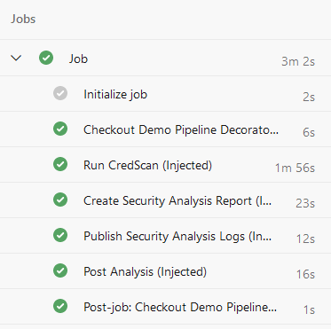

## Part 5: Tips and tricks

Since we were not capable of covering every capability with real decorator examples, here are some useful information.

### Only inject the decorator for a specific project

You may want to inject decorator for specific projects or in the opposite to exclude from specific projects. There are several ways to do so:

```yaml
steps:
- ${{ if eq(resources.repositories['self'].project, '09bbdc2c-51d3-4b05-b97a-0acdc1817cc7') }}:
  - task: anytask
```

For a classic workflow, the name of the "current repo" is different and the reference to the current repository should use *__designer_repo*:

```yaml
steps:
- ${{ if eq(resources.repositories['__designer_repo'].project,'09bbdc2c-51d3-4b05-b97a-0acdc1817cc7') }}:
  - task: anytask
```

Or simply by using *System.TeamProjet* or *System.TeamProjetId* variables:

```yaml
steps:
- ${{ if eq(variables['System.TeamProject'], 'ProjectA')  }}:
  - task: anytask
```

If you want to inject in all projects except a specific one, just inverse the condition:

```yaml
steps:
- ${{ if not(eq(variables['System.TeamProject'], 'ProjectA'))  }}:
  - task: anytask
```

### Do not inject the decorator if a specific variable is present

The following example shows how to *not* inject the decorator if the variable is present and has a value equal to *true*:

```yaml
steps:
- ${{ if ne(variables['skipDecoratorInjection'], 'true')) }}:
  - task: anytask
```

### Do not inject the decorator if a specific task is already present

See part 4 of this guide with the Credential Scanner.

```yaml
steps:
- ${{ if containsValue(job.steps.*.task.id, 'EA576CD4-C61F-48F8-97E7-A3CB07B90A6F') }}::
  - task: anytask
```

### Inject depending on the operating system

This one is a little specific as it cannot be done at the job (top) level because the parsing of decorators happens because an agent is assigned to the run. The test has to be done at the task level:

```yaml
- task: CmdLine@2
  displayName: '(Injected) Task test: OS is Windows'
  condition: eq(variables['Agent.OS'], 'Windows_NT')
  inputs:
    script: |
        echo %AGENT_OS% 

- task: CmdLine@2
  displayName: '(Injected) Task test: OS is Linux'
  condition: eq(variables['Agent.OS'], 'Linux')
  inputs:
    script: |
        echo $AGENT_OS 
```

And the result:

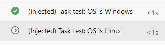

> Note that variables are not called the same way depending on the operating system they are running on. Note also that Agent.OS became AGENT_OS when accessed from within the workflow, [as exlained in the documentation](https://learn.microsoft.com/en-us/azure/devops/pipelines/process/variables?view=azure-devops&tabs=yaml%2Cbatch#environment-variables). It can be tricky.

### Mix conditions

Of course, you can create complex conditions using expressions ([see documentation](https://learn.microsoft.com/en-us/azure/devops/pipelines/process/expressions?WT.mc_id=DOP-MVP-5001511&view=azure-devops)):

```yaml
steps:
- ${{ if or(containsValue(job.steps.*.task.id, 'EA576CD4-C61F-48F8-97E7-A3CB07B90A6F'), variables['skipDecoratorInjection'], 'true')) }}::
  - task: anytask
```

## Conclusion

1. Pipeline decorators are global in the entire AzDO organization. When using Pipeline Decorators, it is important to consider its implications to all the pipelines in the organization and how it could impact existing pipelines
2. Conditional injection is the tricky part to select workflows where you want your decorator to be applied. You may have to use different techniques to  narrow to the relevant pipelines
3. Start super explicit (targeting projects for instance) and when confident, enlarge, repackage and redeploy
4. When your organization has several decorators, and they apply to the same workflow, their order cannot be guaranteed!
5. Conditional injecting targeting a specific task can something inject the same decorator several times in the same workflow (i.e. the Docker task). If the decorator is non-blocking
6. Communicate with end-users when you deploy a new decorator, as they may be surprised to see new tasks within their pipelines

I do hope this guide will help you to leverage the power of these wonderful pipeline decorators.

> If you have any remarks or improvements, don't hesitate to contact me by opening an issue on [the repository](https://github.com/lgmorand/azure-devops-pipeline-decorators).

## Useful links

- Develop a pipeline decorator: [https://learn.microsoft.com/en-us/azure/devops/extend/develop/add-pipeline-decorator](https://learn.microsoft.com/en-us/azure/devops/extend/develop/add-pipeline-decorator)
- All the source code of this white paper: [https://github.com/lgmorand/azure-devops-pipeline-decorators](https://github.com/lgmorand/azure-devops-pipeline-decorators)
- All the runs using these decorators: [https://dev.azure.com/lgmorand/Demo%20Pipeline%20Decorators/](https://dev.azure.com/lgmorand/Demo%20Pipeline%20Decorators/)
- Marketplace Azure DevOps: [https://marketplace.visualstudio.com/azuredevops](https://marketplace.visualstudio.com/azuredevops)
- Pipeline decorator expression context: [https://learn.microsoft.com/en-us/azure/devops/extend/develop/pipeline-decorator-context](https://learn.microsoft.com/en-us/azure/devops/extend/develop/pipeline-decorator-context)
- Built-in Azure DevOps tasks (to get their ID in task.json): [https://github.com/microsoft/azure-pipelines-tasks](https://github.com/microsoft/azure-pipelines-tasks)
- Some examples of real decorators [https://github.com/n3wt0n/AzurePipelinesDecoratorSamples/tree/master/Advanced](https://github.com/n3wt0n/AzurePipelinesDecoratorSamples/tree/master/Advanced)
- Deleting a publisher account [https://lgmorand.github.io/blog/delete-publisher](https://lgmorand.github.io/blog/delete-publisher)

## Thanks

To Clémence Lesné, Adrian Mihailescu, Romain Zert and Fethi Dilmi for proofreading this document.
